# メイプルストーリー ザ・シード 24層 BGMクイズ辞書
## インストール方法
### Microsoft IME
1. IMEのオプションから「設定」を開きます。  
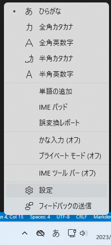
2. 「学習と辞書」を選びます。  
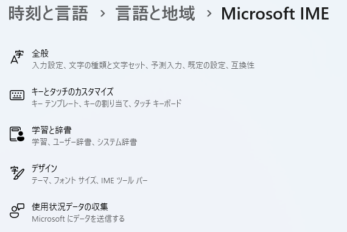
3. 「ユーザー辞書」ツールを開きます。  
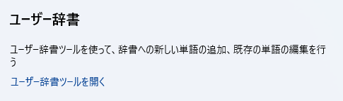
4. 「ツール」→「テキスト ファイルからの登録」を選びます。  
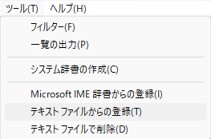
5. Microsoft用辞書ファイルを開きます。  
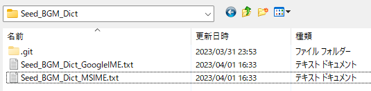
6. 「登録処理を終了しました。」と表示されれば完了です。  
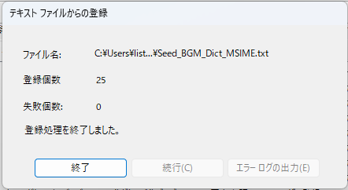

### Google 日本語入力
1. Google 日本語入力の右クリックメニューから「辞書ツール」を開きます。  
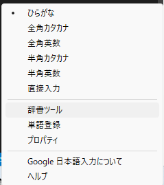
2. 「管理」→「新規辞書にインポート」を選びます。  
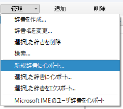
3. Google 日本語入力用ファイルを選び、辞書名を入力して「インポート」をクリックします。  
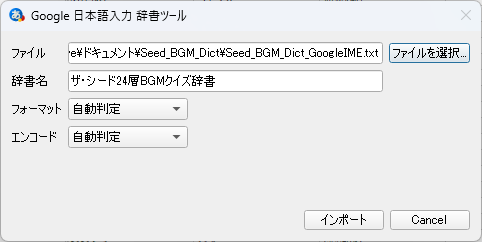
4. 「〇〇件を(辞書名)にインポートしました。」と表示されれば完了です。  
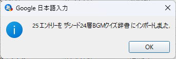

## 利用方法
ザ・シード24層に入場し、町の名前を入力する画面を開きます。  
アリーシャが教えてくれるBGMのヒントの**最初の5文字の読み**を入力します。  
(利用例の画面では「ぎこぎこ、」まで入力)  
そのままスペースキーで変換すると正解が入力されます。  
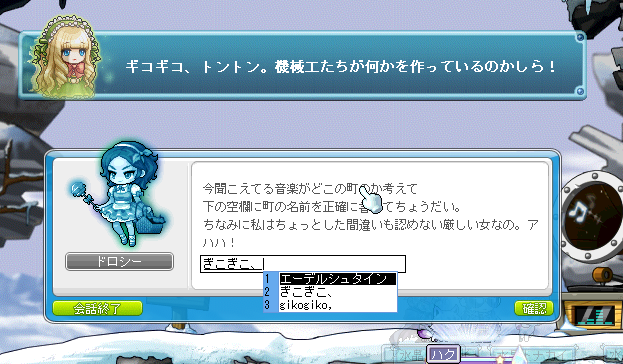

## 免責事項
本辞書の作成者はメイプルストーリー公式とは一切関係がありません。  
ご使用にあたって何らかの損害や不利益が発生した場合でも、作成者は一切責任を負いません。  

## 謝辞
本辞書は以下の情報を参考に作成させていただきました。  
この場を借りてお礼申し上げます。  
i. けものフレンズ辞書(ヴォストク様 twitter@vostok061)  
https://harutori.org/works/kemodic.html  
i. シード　お助けシート(うみたぁん様 twitter@umitan_maple)  
https://docs.google.com/spreadsheets/d/1kvmRZaeuiT2ogZfI_ny1EBPtFDxAekZKZzwNE3U9Wkg/edit#gid=952136525

## その他
万が一辞書の内容に間違い等がありましたらtwitter@canvasnoteまでご連絡いただければ幸いです。  
なるべく修正します。  
